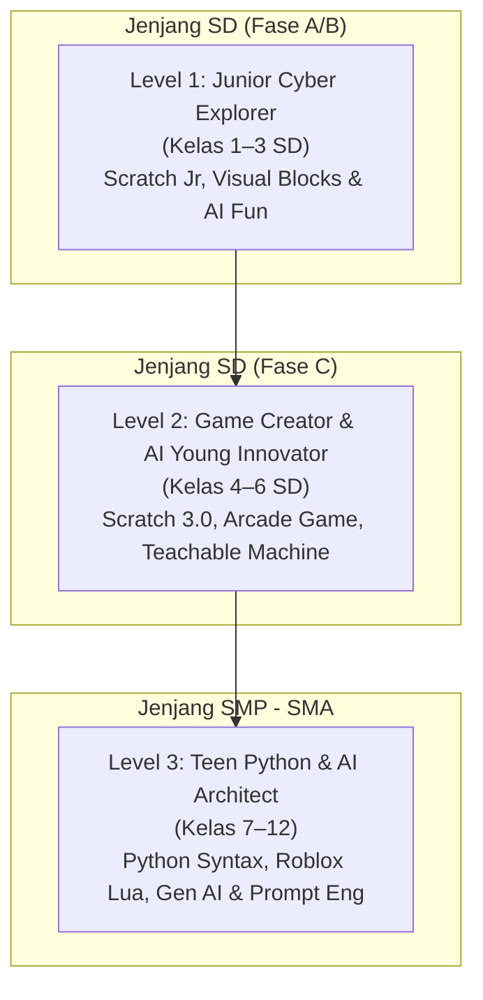
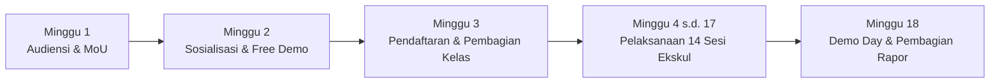

# PROPOSAL PENAWARAN PROGRAM EKSTRAKURIKULER
## CODING, ROBOTIKA & ARTIFICIAL INTELLIGENCE (AI)
### *"Membangun Generasi Kreator Teknologi Masa Depan yang Berkarakter, Kritis, dan Berdaya Saing Global"*

---

**Nomor Dokumen :** 018/PRO-EKSKUL/BKD/X/2026  
**Lampiran        :** 1 (Satu) Berkas Lengkap  
**Perihal         :** Penawaran Program Kemitraan Ekstrakurikuler Coding & AI  

---

### KEPADA YTH.
**Bapak / Ibu Kepala Sekolah & Tim Pimpinan Yayasan**  
di Tempat  

Dengan hormat,

Seiring dengan pesatnya transformasi teknologi global di era Artificial Intelligence (Kecerdasan Buatan) serta implementasi penguatan profil pelajar dan *Computational Thinking* dalam Kurikulum Merdeka, dunia pendidikan dituntut untuk membekali peserta didik tidak hanya sebagai konsumen teknologi (*passive consumer*), melainkan sebagai pencipta teknologi (*active creator*) yang memiliki logika berpikir terstruktur, kreatif, dan berdaya cipta tinggi.

**BEEKODING ACADEMY** hadir sebagai lembaga pendidikan teknologi terdepan yang berfokus pada pengembangan keahlian *Coding, Digital Literacy, Robotics, dan Artificial Intelligence* ramah anak. Melalui pendekatan *Project-Based Learning* yang menyenangkan dan aplikatif, kami membimbing siswa dari usia dini hingga remaja untuk memahami algoritma, menciptakan karya digital orisinal, serta memahami pemanfaatan AI secara etis dan bertanggung jawab.

Bersama ini kami mengajukan penawaran kerja sama penyelenggaraan **Program Ekstrakurikuler Coding, Robotika & Artificial Intelligence** di sekolah yang Bapak/Ibu pimpin untuk Tahun Ajaran 2026/2027.

Sebagai bentuk komitmen awal dan apresiasi kami, pihak sekolah berhak mendapatkan fasilitas **1x Sesi Sosialisasi & Workshop / Demo Day Ekskul GRATIS** bagi para siswa dan orang tua murid sebelum program dimulai secara resmi.

Besar harapan kami agar penawaran ini dapat disambut baik demi mencetak generasi unggul yang siap memimpin era digital. Atas perhatian dan kesempatan yang diberikan, kami ucapkan terima kasih yang sebesar-besarnya.

Depok/Jakarta, 8 Oktober 2026  
**Hormat kami,**  
**Manajemen Beekoding Academy**  

\
**(Febri Hasan, S.Kom., M.T.I.)**  
*Academic Director & Founder Beekoding*  
Hotline WhatsApp: +62 818-1890-1737  
Email: halo@beekoding.id  
Website: https://beekoding.pages.dev  

---

\pagebreak

# DAFTAR ISI

1. **PROFIL LEMBAGA BEEKODING ACADEMY**
2. **LATAR BELAKANG & URGENSI PROGRAM**
3. **VISI, MISI, DAN TUJUAN PROGRAM**
4. **KEUNGGULAN KOMPETITIF BEEKODING (VALUE PROPOSITION)**
5. **STRUKTUR & JENJANG PROGRAM EKSTRAKURIKULER**
6. **SILABUS PEMBELAJARAN 14 SESI PER SEMESTER (RINCIAN MATERI)**
   - *Jenjang A: Junior Cyber Explorer (SD Kelas 1–3)*
   - *Jenjang B: Game Creator & AI Young Innovator (SD Kelas 4–6)*
   - *Jenjang C: Teen Python & AI Architect (SMP – SMA)*
7. **METODE PEMBELAJARAN & PENDEKATAN PEDAGOGIK**
8. **SISTEM EVALUASI, RAPOR 8 PILAR, & SERTIFIKASI DIGITAL**
9. **SARANA, PRASARANA, & PEMBAGIAN TANGGUNG JAWAB**
10. **SKEMA BIAYA & PILIHAN KERJA SAMA (B2B BENEFIT)**
11. **TIMELINE IMPLEMENTASI & TAHAPAN KERJASAMA**
12. **PENUTUP & LEMBAR KONFIRMASI KEMITRAAN**

---

\pagebreak

# 1. PROFIL LEMBAGA BEEKODING ACADEMY

**Beekoding Academy** adalah ekosistem edukasi teknologi modern yang berdedikasi membimbing anak-anak usia 6 hingga 17 tahun dalam menguasai keahlian pemrograman komputer, logika komputasi, dan kecerdasan buatan.

* **Nama Lembaga:** Beekoding Academy
* **Fokus Layanan:** Kursus Coding Anak, Kelas Ekstrakurikuler Sekolah, Bootcamp Liburan, dan Asesmen Bakat Digital.
* **Website Resmi:** [https://beekoding.pages.dev](https://beekoding.pages.dev)
* **Portal Siswa & Wali Murid:** [https://beekoding.pages.dev/#portal](https://beekoding.pages.dev/#portal)
* **Kanal Komunikasi:** +62 818-1890-1737 / Instagram: `@beekoding.id`
* **Portofolio Layanan:** Telah mendampingi lebih dari 380+ siswa dengan kurikulum teruji, sertifikasi digital ber-QR Code, serta sistem pemantauan berkala rapor 8 pilar kognitif.

---

# 2. LATAR BELAKANG & URGENSI PROGRAM

1. **Tantangan Generasi Layar (Screen-Time Trap):** Mayoritas anak saat ini menghabiskan waktu 4–6 jam sehari di depan gawai (*gadget*) hanya untuk bermain game atau menonton video secara pasif. Melalui coding dan AI, kebiasaan konsumtif ini dibelokkan menjadi aktivitas kreatif produktif di mana anak menciptakan game dan animasi mereka sendiri.
2. **Kebutuhan Kurikulum Merdeka & Abad 21:** Kementerian Pendidikan menekankan pentingnya penguatan 4C (*Critical Thinking, Creativity, Collaboration, Communication*) dan *Computational Thinking*. Coding merupakan sarana paling konkret untuk mengasah kemampuan dekomposisi masalah, pengenalan pola, abstraksi, dan perancangan algoritma.
3. **Ledakan Kecerdasan Buatan (AI Era):** Hadirnya Generative AI dan otomatisasi menuntut generasi muda memiliki literasi AI sejak dini—memahami cara kerja AI, cara berinteraksi dengan AI secara efektif (*prompt engineering*), serta menjaga keamanan dan etika data pribadi di ruang siber.

---

# 3. VISI, MISI, DAN TUJUAN PROGRAM

### Visi:
Menjadi mitra strategis sekolah terdepan dalam membentuk generasi pembelajar yang berkarakter, fasih berteknologi, dan siap memimpin peradaban di era Artificial Intelligence (Society 5.0).

### Misi:
1. Menyelenggarakan kegiatan ekstrakurikuler coding dan AI yang inklusif, menyenangkan, dan berbobot akademis.
2. Melatih daya nalar, logika sekuensial, dan persistensi anak dalam memecahkan masalah kompleks (*problem-solving*).
3. Memberikan wadah aktualisasi bakat siswa melalui penciptaan proyek portofolio nyata dan kompetisi teknologi.

### Tujuan Kegiatan:
* Siswa mampu memahami logika dasar pemrograman (algoritma, perulangan, kondisi percabangan, fungsi, dan variabel).
* Siswa memiliki portofolio digital mandiri yang dapat dipresentasikan pada ajang pameran sekolah (*Exhibition / Demo Day*).
* Mengharumkan nama sekolah dalam ajang kompetisi coding dan sains teknologi tingkat regional maupun nasional.

---

# 4. KEUNGGULAN KOMPETITIF BEEKODING (VALUE PROPOSITION)

Mengapa sekolah memilih bermitra dengan Beekoding Academy?

1. **Akses Portal Belajar Mandiri Terintegrasi:**  
   Setiap siswa dan orang tua mendapatkan akun di Portal Siswa Beekoding (`beekoding.pages.dev/#portal`). Orang tua dapat memantau presensi, rangkuman materi mingguan, capaian tugas, hingga mengakses sertifikat secara transparan dari gawai masing-masing.
2. **Laporan Rapor 8 Pilar Kognitif Ilmiah:**  
   Di akhir semester, orang tua dan sekolah menerima lembar evaluasi digital & cetak A4 yang mengukur 8 aspek fundamental: *Computational Thinking, Logika Algoritma, Kreativitas Desain, Problem Solving, Disiplin Belajar, Kecepatan Eksekusi, Sikap Kolaborasi, dan Pemahaman Etika Digital*.
3. **E-Sertifikat Resmi Ber-QR Code Verification:**  
   Setiap sertifikat kelulusan memiliki ID unik dan tautan verifikasi online instan untuk menjamin validitas capaian kompetensi siswa.
4. **Instruktur Muda Berpengalaman & Bersahabat:**  
   Mentor-mentor Beekoding adalah praktisi teknologi dan lulusan perguruan tinggi terkemuka yang telah melalui pelatihan pedagogik ramah anak (*child-safe teaching standard*).
5. **Dukungan Kegiatan Pameran Sekolah (Demo Day):**  
   Tim Beekoding mendampingi dan memfasilitasi pelaksanaan *Demo Day / Science Fair* di akhir semester, di mana hasil karya siswa dipamerkan kepada orang tua dan warga sekolah.

---

# 5. STRUKTUR & JENJANG PROGRAM EKSTRAKURIKULER

Kegiatan dirancang berjenjang menyesuaikan tahap perkembangan kognitif dan motorik siswa:

* **Durasi per Sesi :** 90 s.d. 120 Menit
* **Jumlah Pertemuan :** 14 Pertemuan Efektif per Semester (1 Sesi / Minggu)
* **Rasio Mentor Siswa :** 1 Mentor per 10–12 Siswa (pendampingan intensif)

---

\pagebreak

# 6. SILABUS PEMBELAJARAN 14 SESI PER SEMESTER

---

### JENJANG A: JUNIOR CYBER EXPLORER (SD KELAS 1–3)
**Fokus :** Pengenalan Logika Komputasi, Visual Block Coding, Animasi Interaktif, dan Dasar AI  
**Alat Pembelajaran :** ScratchJr / Scratch 3.0 Desktop, Unplugged Computational Thinking Kits  

| Sesi | Topik Pembelajaran | Sasaran Kompetensi & Aktivitas Siswa | Output Proyek Siswa |
| :---: | :--- | :--- | :--- |
| **01** | **Petualangan Perdana Si Lebah Cilik** | Pengenalan antarmuka coding blok, sprite, kanvas gerak, koordinat langkah sederhana (maju, belok). | Animasi Karakter Berjalan & Menyapa |
| **02** | **Algoritma Langkah Teratur (Sequencing)** | Memahami bahwa komputer bekerja berdasarkan urutan instruksi langkah demi langkah secara disiplin. | Animasi Cerita "Perjalanan ke Sekolah" |
| **03** | **Perulangan Ajaib (Loops & Repeat)** | Menggunakan blok pengulangan agar karakter dapat melompat dan menari berulang tanpa kode panjang. | Animasi Tari Karakter Musik |
| **04** | **Suara, Dialog & Ekspresi Karakter** | Merekam suara sendiri, menyisipkan efek audio, dan sinkronisasi balon percakapan antar dua karakter. | Mini Drama Kartun Interaktif |
| **05** | **Interaksi & Kontrol Sentuh (Events)** | Belajar instruksi "Ketika Karakter Diklik" dan "Ketika Tombol Keyboard Ditekan" untuk memicu aksi. | Game Mini "Tangkap Apel Jatuh (Versi 1)" |
| **06** | **Pendeteksi Tabrakan (Sensing Blocks)** | Menggunakan sensor tabrakan antar sprite warna dan batas layar panggung (*bounce on edge*). | Proyek "Mobil Melintasi Rintangan Labirin" |
| **07** | **Logika Keputusan Sederhana (If-Then)** | Pengenalan logika "Jika Menyentuh Musuh, Maka Berkurang". Mengenalkan konsep aturan permainan. | Game Edukasi "Pilah Sampah Organik" |
| **08** | **Evaluasi Tengah Semester & Pameran Mini** | Evaluasi pemahaman logika dasar, review proyek bersama mentor, dan presentasi karya mini di depan kelas. | Lembar Asesmen Mandiri Sesi 1–7 |
| **09** | **Pengenalan Kecerdasan Buatan Cilik** | Memahami bagaimana komputer bisa mengenali wajah, senyuman, dan gerakan tangan menggunakan kamera. | Proyek "Karakter Merespons Gerakan Tubuh" |
| **10** | **Sistem Skor & Nilai Permainan (Variables)** | Belajar membuat kotak penyimpan nilai (*Score Box*) yang bertambah setiap kali menangkap item. | Game "Lebah Mengumpulkan Madu Bertarget" |
| **11** | **Multi-Level Challenge & Pergantian Layar** | Membuat alur permainan berpindah ke babak selanjutnya (*Change Backdrop when Score >= 10*). | Game 2 Level Petualangan |
| **12** | **Desain Karya Akhir (Capstone Project - Part 1)** | Siswa merancang konsep karya mandiri, memilih karakter, menyusun alur cerita, dan membuat sketsa game. | Lembar Desain & Kerangka Kode Final |
| **13** | **Penyempurnaan Karya & Polishing (Capstone - Part 2)** | Memperbaiki bug (*debugging*), menambahkan musik latar, efek animasi menang/kalah (*Game Over*). | Game Lengkap Siap Pameran |
| **14** | **Demo Day, Presentasi & Penyerahan Rapor** | Siswa mempresentasikan game buatannya di depan orang tua/guru, bermain game teman, & penganugerahan piagam. | Sertifikat Kelulusan & Rapor 8 Pilar |

---

### JENJANG B: GAME CREATOR & AI YOUNG INNOVATOR (SD KELAS 4–6)
**Fokus :** Logika Game Lanjutan, Variabel, Fisika Game Sederhana, Pengenalan Machine Learning & AI  
**Alat Pembelajaran :** Scratch 3.0 Web/Desktop, Google Teachable Machine, AI For Kids Sandbox  

| Sesi | Topik Pembelajaran | Sasaran Kompetensi & Aktivitas Siswa | Output Proyek Siswa |
| :---: | :--- | :--- | :--- |
| **01** | **Paradigma Game Maker & Computational Thinking** | Dekomposisi game populer: menganalisis mekanik gerak, aturan batasan, variabel status, dan sistem scoring. | Struktur Rancangan Game Mandiri |
| **02** | **Navigasi Koordinat Kartesius 2D (X, Y)** | Memahami sumbu X (horizontal) dan Y (vertikal), membuat gerakan smooth menggunakan manipulasi kecepatan. | Gerakan Karakter Smooth 8 Arah |
| **03** | **Variabel Dinamis: Health, Ammo & Score** | Mengelola banyak variabel sekaligus: Darah karakter, sisa waktu hitung mundur (*timer*), dan skor bonus. | Game Bertahan Hidup Waktu Terbatas |
| **04** | **Konsep Cloning & Efek Partikel** | Menggunakan fitur *Create Clone of Myself* untuk membuat hujan meteor dan peluru yang muncul dinamis. | Proyek Space Shooter Arkade (Dasar) |
| **05** | **Simulasi Gravitasi Sederhana (Platformer Physics)** | Membuat mekanik lompat (*jumping logic*), gravitasi (*velocity Y*), dan pijakan lantai yang realistis. | Mini Platformer Mario-Style |
| **06** | **Broadcast Messaging & State Management** | Menggunakan sinyal siaran (*Broadcast Messages*) untuk mengatur status alur: Menu Utama -> Main -> Game Over. | Game dengan Sistem Menu Lengkap |
| **07** | **Kecerdasan Buatan 1: Melatih Model AI Sendiri** | Menggunakan *Google Teachable Machine* untuk melatih komputer membedakan pose tubuh dan ekspresi wajah. | Model Klasifikasi Data Kamera |
| **08** | **Integrasi AI ke Scratch (Pose & Gesture Control)** | Menghubungkan webcam AI sebagai pengendali game (menggerakkan karakter menggunakan gerakan kepala/tangan). | Game Kontrol Bebas Sentuh (AI Game) |
| **09** | **Kecerdasan Buatan 2: Text Recognition & Chatbot** | Mengenal cara kerja pemrosesan bahasa alami (NLP) sederhana; membuat kuis tebak kata berbasis chatbot. | Chatbot Edukasi Ramah Anak |
| **10** | **Algoritma Musuh Otomatis (Enemy AI Logic)** | Membuat bot lawan yang mampu mengejar koordinat pemain (*path tracking logic*) secara otomatis. | Game Pac-Man Style Maze Chaser |
| **11** | **Debugging Mastery & Clean Code Practice** | Membedah kesalahan kode umum (*infinite loops*, glitch koordinat, bug variabel), mengoptimalkan performa. | Game Bebas Bug & Responsif |
| **12** | **Capstone Project: Perancangan Proyek Terpadu** | Siswa mengombinasikan logika game arkade dengan fitur sensor cerdas / sistem penilaian komprehensif. | Dokumen GDD (Game Design Document) |
| **13** | **Capstone Project: Beta Testing & Polishing** | Pengujian pengguna (*playtesting* bersama teman), perbaikan aspek estetika visual, tata suara, dan credit title. | Karya Final Siap Publikasi Web |
| **14** | **Showcase Exhibition, Sidang Karya & Penghargaan** | Presentasi fungsionalitas game, pameran stan demo untuk wali murid, penerimaan sertifikat & rapor akademik. | Portofolio Web & Piagam Resmi |

---

### JENJANG C: TEEN PYTHON & AI ARCHITECT (SMP – SMA)
**Fokus :** Pemrograman Berbasis Teks (Python), Algoritma Terstruktur, 3D Game Dev (Roblox Lua), Generative AI & Prompt Engineering  
**Alat Pembelajaran :** Python 3 / IDLE / VS Code, Replit, Roblox Studio (Lua Scripting), AI API Sandbox  

| Sesi | Topik Pembelajaran | Sasaran Kompetensi & Aktivitas Siswa | Output Proyek Siswa |
| :---: | :--- | :--- | :--- |
| **01** | **Selamat Datang di Dunia Real-World Programming** | Instalasi & environment setup; Sintaks dasar Python: perintah print(), input(), tipe data (string, integer, float). | Program CLI "Interactive Cyber Bio" |
| **02** | **Operasi Aritmatika, Logika & Kondisional (If-Elif-Else)** | Logika percabangan kompleks, operator komparasi (`>`, `<`, `==`, `!=`), pembuatan branching story berbasis teks. | Game Teks "Dungeon Escape RPG" |
| **03** | **Struktur Perulangan (For Loop, While Loop) & Lists** | Mengelola koleksi data dengan List/Array, manipulasi item data, iterasi efisien, dan pencegahan infinite loop. | Sistem Pengelola Inventaris Barang |
| **04** | **Fungsi Modular (Def Functions) & Validasi Input** | Menulis kode yang reusable dengan fungsi berkursi, return values, parameter argument, dan error handling (`try-except`). | Kalkulator Finansial & Konversi Nilai |
| **05** | **Game Development 2D dengan Modul Pygame / Turtle** | Membangun jendela visual, event loop keyboard, penggambaran objek grafis, dan animasi gerak sumbu piksel. | Game Arkade Retro (Snake / Pong) |
| **06** | **Dasar 3D Game Programming: Roblox Studio & Lua (Part 1)** | Pengenalan environment 3D, physics part, koordinat 3 dimensi (Vector3), pembuatan skrip trigger `Touched:Connect()`. | Rintangan Obby 3D Interaktif |
| **07** | **Roblox Studio & Lua (Part 2): Leaderstats & Game Economy** | Membuat sistem koin pemain, papan skor (*Leaderboard*), checkpoint pendaratan, dan toko item menggunakan scripting Lua. | Game Roblox 3D Multiplayer Berfungsi |
| **08** | **Evaluasi Tengah Semester: Code Review & Best Practices** | Refactoring kode, penulisan dokumentasi komentar, standar PEP8, dan evaluasi logika pemrograman murni. | Laporan Kinerja Koding Tengah Semester |
| **09** | **Pengenalan Machine Learning & Data Processing Sederhana** | Membaca file data, membuat grafik visualisasi data sederhana dengan library Python (Matplotlib), memprediksi tren nilai. | Visualisasi Grafik Data Sains Sederhana |
| **10** | **Generative AI, Large Language Models (LLM) & Prompting** | Memahami arsitektur Transformer dan cara kerja LLM; Teknik *Chain-of-Thought Prompting* & etika pemanfaatan AI untuk belajar. | Asisten Belajar AI Terpersonalisasi |
| **11** | **Membangun Aplikasi Chatbot Cerdas dengan API AI** | Menghubungkan script Python ke API kecerdasan buatan, membuat filter etis dan instruksi sistem (*system prompt role*). | Chatbot Spesialis Sains / Tutor Sejarah |
| **12** | **Capstone Project: Perancangan Solusi Teknologi Nyata** | Siswa memilih fokus proyek: Game 3D Roblox orisinal, Game Python GUI, atau Aplikasi Web AI berbasis masalah nyata di sekolah. | Proposal Solusi & Arsitektur Sistem |
| **13** | **Capstone Project: Pengujian, Optimasi & Deployment** | Finalisasi kode, pengujian keandalan (*stress test*), packaging berkas aplikasi, persiapan materi presentasi pitch. | Repositori Kode & Berkas Siap Jalankan |
| **14** | **Grand Showcase, Pitching Presentation & Sertifikasi** | Presentasi ala *Startup Pitching*, unjuk kerja sistem di depan penguji, penyerahan rapor 8 pilar kognitif & ijazah kelulusan. | Sertifikat Kompetensi & E-Portfolio |

---

\pagebreak

# 7. METODE PEMBELAJARAN & PENDEKATAN PEDAGOGIK

Beekoding menerapkan metodologi instruksional modern yang terbukti meningkatkan keterlibatan dan daya serap anak:

1. **Project-Based Learning (PBL):**  
   Siswa tidak menghafal teori yang abstrak. Setiap teori langsung diaplikasikan untuk membangun sebuah karya konkret di setiap sesi pertemuan (*1 Pertemuan = 1 Capaian Karya*).
2. **4 Pilar Computational Thinking:**
   * **Dekomposisi:** Memecah masalah game yang rumit menjadi komponen-komponen kecil.
   * **Pengenalan Pola:** Mengenali kesamaan logika gerak pada berbagai karakter.
   * **Abstraksi:** Menyaring informasi penting dan mengabaikan detail yang belum diperlukan.
   * **Algoritma:** Menulis urutan langkah yang jelas dan logis untuk dijalankan mesin.
3. **Konsep Gamifikasi & Positivitas:**  
   Sistem reward lencana digital (*achievement badges*) untuk memicu motivasi eksplorasi siswa tanpa rasa takut salah (*Growth Mindset through Debugging*).

---

# 8. SISTEM EVALUASI, RAPOR 8 PILAR, & SERTIFIKASI DIGITAL

Evaluasi pembelajaran dilakukan secara berkesinambungan dan komprehensif:

### A. Rapor 8 Pilar Kognitif Beekoding
Di setiap akhir semester, wali murid mendapatkan laporan terperinci dalam format digital interaktif di portal serta lembar cetak resmi A4, mencakup:
1. *Computational Thinking & Algoritma*
2. *Kreativitas & Desain Visual*
3. *Pemecahan Masalah (Problem Solving & Debugging)*
4. *Ketekunan & Kecepatan Belajar (Pace)*
5. *Penguasaan Sintaks & Alat Digital*
6. *Sikap Kolaboratif & Etika Penggunaan Teknologi*
7. *Kehadiran & Partisipasi Kelas*
8. *Kualitas Karya Akhir (Capstone Project)*

### B. E-Sertifikat Kelulusan Resmi
* Diterbitkan langsung oleh Beekoding Academy dengan tanda tangan resmi Direktur Akademik.
* Dilengkapi **QR Code Verification** aktif yang terhubung langsung ke basis data `https://beekoding.pages.dev/#portal`, dapat dilampirkan sebagai portofolio prestasi siswa saat melanjutkan jenjang pendidikan.

---

# 9. SARANA, PRASARANA, & PEMBAGIAN TANGGUNG JAWAB

Untuk menjamin kelancaran pelaksanaan, hak dan kewajiban masing-masing pihak dirumuskan secara transparan:

### A. Fasilitas & Tanggung Jawab Pihak Beekoding:
* Menyediakan **Mentor / Instruktur Profesional** yang telah tersertifikasi pedagogi dan teknis.
* Menyediakan seluruh **Bahan Ajar, Modul Digital, Panduan Siswa, dan Lembar Kerja (*Worksheet*)**.
* Menyediakan akses akun **LMS & Portal Siswa Beekoding** untuk seluruh peserta.
* Bertanggung jawab penuh terhadap pelaksanaan evaluasi berkala dan penerbitan **Rapor 8 Pilar & E-Sertifikat**.
* Mendukung penuh pelaksanaan kegiatan **Pameran / Demo Day Ekskul** di akhir semester.

### B. Fasilitas & Tanggung Jawab Pihak Sekolah:
* Menyediakan ruangan belajar yang kondusif (Lab Komputer sekolah atau ruang kelas reguler).
* Menyediakan akses jaringan Wi-Fi/Internet yang memadai selama sesi berlangsung.
* Memfasilitasi perangkat komputer/laptop (dapat menggunakan fasilitas lab sekolah atau siswa membawa laptop pribadi/BYOD).
* Membantu memfasilitasi publikasi dan pendaftaran ekskul kepada para orang tua murid di awal semester.

---

\pagebreak

# 10. SKEMA BIAYA & PILIHAN MODEL KERJASAMA (B2B BENEFIT)

Kami menyadari pentingnya keterjangkauan biaya bagi seluruh lapisan orang tua murid. Oleh karena itu, Beekoding menghadirkan skema investasi edukasi yang **sangat bersahabat, terjangkau, dan transparan**:

### PILIHAN 1: SKEMA SPP MANDIRI SISWA (BERSIFAT BULANAN / RAMAH KANTONG)
*(Paling diminati sekolah: Sangat terjangkau bagi wali murid, tanpa membebani kas sekolah, sekolah mendapatkan fasilitas revenue sharing)*

* **Biaya Investasi per Siswa :** **Rp 65.000,- / Sesi**  
  *(Dapat dibayarkan secara bulanan sebesar **Rp 220.000,- / bulan** untuk 4 pertemuan, atau paket 1 semester 14 pertemuan sebesar **Rp 790.000,-**)*
* **Pilihan Paket Komunitas / Rombel Besar (>= 20 Siswa) :** **Rp 50.000,- / Sesi** (*Rp 175.000,- / bulan*)
* **Jumlah Sesi :** 14 Pertemuan per Semester
* **Minimal Kuota :** 12 – 15 Siswa per Kelas
* **Benefit Bagi Hasil untuk Sekolah (Facility Sharing Fee):**  
  Sekolah berhak mendapatkan kontribusi fasilitas sebesar **10% – 15% dari total penerimaan SPP siswa**, yang disetorkan secara berkala ke kas sekolah/yayasan.

---

### PILIHAN 2: SKEMA FLAT KONTRAK INSTITUSI (DIBIAYAI SEKOLAH / YAYASAN / DANA BOS)
*(Cocok untuk sekolah yang menggratiskan ekskul bagi siswa atau mengintegrasikannya ke kalender kurikulum muatan lokal)*

* **Biaya Paket Flat per Kelas / Semester :** **Rp 6.500.000,- s.d. Rp 7.500.000,- / Rombel / Semester**
* **Kapasitas Peserta :** Hingga 20 Siswa per rombongan belajar (jatuhnya hanya **~Rp 23.000,- s.d. Rp 26.000,- / siswa / pertemuan**)
* **Termasuk :** 14 Pertemuan penuh, Mentor Pengajar, Modul & Handout Cetak/Digital, Rapor 8 Pilar Kognitif, Lisensi Akun Portal Web Siswa, dan E-Sertifikat Ber-QR Code.

---

### TABEL PERBANDINGAN NILAI INVESTASI

| Komponen Layanan | Ekstrakurikuler Lain (Pasaran) | Kemitraan Ekskul BEEKODING (Bersahabat) |
| :--- | :---: | :---: |
| Biaya per Pertemuan | Rp 100.000 – Rp 150.000 / sesi | ✅ **Hanya Rp 50.000 – Rp 65.000 / sesi** |
| Kurikulum AI & Coding Terintegrasi | ❌ Terbatas Robot Rakit Manual | ✅ **Scratch, Python, Roblox, & Gen AI Lengkap** |
| Portal Web Siswa & Orang Tua 24/7 | ❌ Tidak Ada | ✅ **Tersedia (`beekoding.pages.dev/#portal`)** |
| Rapor Evaluasi Ilmiah 8 Pilar | ❌ Lembar nilai biasa | ✅ **Rapor Kognitif Digital & Cetak A4 Resmi** |
| Verifikasi Sertifikat Online QR | ❌ Manual cetak biasa | ✅ **QR Code Verification Online** |
| Sesi Sosialisasi & Demo Gratis | ❌ Berbayar | ✅ **1x Free Trial / Demo Day Awal** |
| Bagi Hasil Fasilitas untuk Sekolah | ❌ Jarang Disediakan | ✅ **10% – 15% Masuk Kas Sekolah** |

---

# 11. TIMELINE IMPLEMENTASI & TAHAPAN KERJASAMA

Tahapan pelaksanaan program disusun terencana agar tidak mengganggu aktivitas belajar-mengajar utama sekolah:

1. **Tahap 1: Audiensi & Kesepakatan (MoU):** Pembahasan teknis jadwal hari/jam ekskul dan penandatanganan nota kesepahaman.
2. **Tahap 2: Sosialisasi & Free Workshop Demo:** Mentor Beekoding hadir di sekolah memberikan sesi pengenalan gratis berdurasi 45–60 menit kepada calon peserta.
3. **Tahap 3: Pendaftaran & Pembagian Rombongan Belajar:** Siswa mendaftar melalui formulir online / tata usaha sekolah sesuai jenjang usianya.
4. **Tahap 4: Pelaksanaan Pembelajaran (14 Sesi):** Kelas berjalan 1 kali seminggu dipandu mentor berpengalaman dengan pemantauan via portal web.
5. **Tahap 5: Pameran Akhir (Demo Day) & Laporan Evaluasi:** Penyerahan dokumen rapor 8 pilar, piagam kelulusan, dan presentasi karya capstone di hadapan orang tua.

---

\pagebreak

# 12. PENUTUP & LEMBAR KONFIRMASI KEMITRAAN

Demikian proposal penawaran kegiatan ekstrakurikuler ini kami sampaikan. Kami yakin kerja sama sinergis antara pihak sekolah dengan **Beekoding Academy** akan memberikan nilai tambah (*branding*) yang signifikan bagi reputasi sekolah sebagai institusi pendidikan modern yang adaptif terhadap kemajuan era kecerdasan buatan.

Untuk diskusi lebih lanjut, penyesuaian jadwal, atau permohonan sesi demo kelas gratis, Bapak/Ibu dapat menghubungi kami melalui kontak resmi berikut:

* **Contact Person / WhatsApp :** +62 818-1890-1737 (Lead Academic Partnership)
* **Email Resmi                 :** halo@beekoding.id
* **Alamat Website              :** https://beekoding.pages.dev

---

### LEMBAR KONFIRMASI KESEDIAAN KEMITRAAN

Dengan ini, pihak sekolah menyatakan:

[  ] **BERMINAT** untuk menjadwalkan **Sesi Sosialisasi / Demo Day Gratis**  
[  ] **BERMINAT** untuk menyelenggarakan Ekstrakurikuler Coding & AI Beekoding  
[  ] Memerlukan audiensi / presentasi tatap muka lebih lanjut dengan tim pimpinan sekolah  

* Nama Sekolah / Yayasan : ____________________________________________________  
* Nama Penanggung Jawab  : ____________________________________________________  
* Jabatan                : [  ] Kepala Sekolah   [  ] Wakasek Kesiswaan   [  ] Koordinator Ekskul  
* Nomor WhatsApp / HP    : ____________________________________________________  
* Rencana Hari & Jam     : Hari _______________, Pukul ________ s.d. ________ WIB  

\
\
Mengetahui,  
**Pihak Sekolah / Yayasan**  

\
\
\
( ___________________________________ )  
*Nama Jelas & Cap Stempel Sekolah*  
